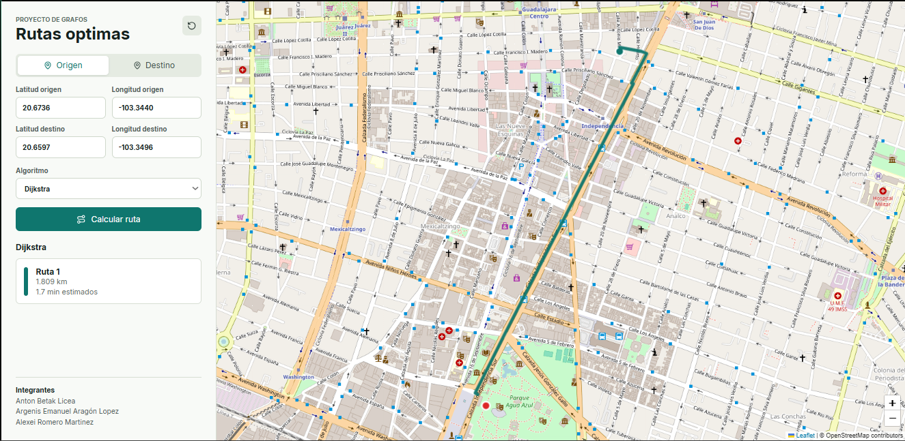
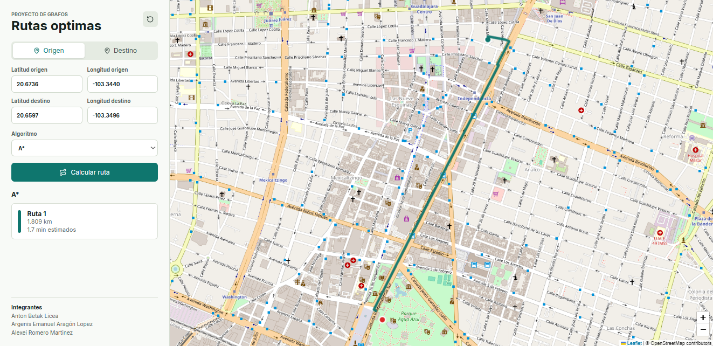
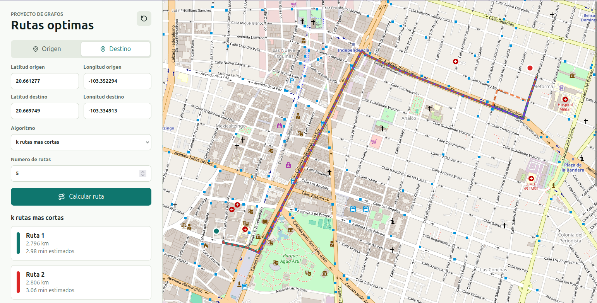
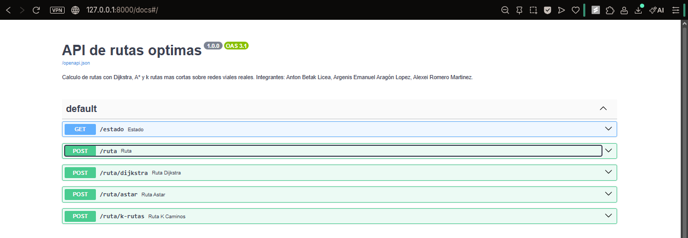

# Rutas óptimas con grafos viales reales

## Integrantes

- Anton Betak Licea
- Argenis Emanuel Aragón Lopez
- Cristian Alexei Romero Martínez

Aplicación web para calcular y visualizar rutas rápidas entre dos puntos geográficos usando grafos de redes viales reales. El servidor usa FastAPI, OSMnx y NetworkX; la interfaz usa React y Leaflet.

## Características

- Descarga de red vial real de una ciudad mexicana con OSMnx.
- Modelado de la red como grafo NetworkX.
- Cálculo de rutas con Dijkstra, A* y k rutas más cortas.
- Distancia total y tiempo estimado de recorrido.
- API REST documentada automáticamente en `/docs`.
- Mapa interactivo con selección por coordenadas o clic.

## Capturas






## Estructura

```text
.
├── backend/
│   ├── app/
│   │   ├── main.py
│   │   ├── models.py
│   │   ├── routing.py
│   │   └── settings.py
│   └── requirements.txt
└── frontend/
    ├── index.html
    ├── package.json
    ├── src/
    │   ├── App.jsx
    │   ├── main.jsx
    │   └── styles.css
    └── vite.config.js
```

## Servidor

### Instalación

```bash
cd backend
python3 -m venv .venv
source .venv/bin/activate
pip install -r requirements.txt
```

### Ejecución

```bash
fastapi dev app/main.py
```

También puedes usar:

```bash
uvicorn app.main:app --reload
```

La API queda disponible en `http://127.0.0.1:8000`.

### Configuración opcional

Variables de entorno soportadas:

| Variable                    |              Valor por defecto | Descripcion                                          |
|-----------------------------|-------------------------------:|------------------------------------------------------|
| `ROUTING_PLACE_NAME`        | `Guadalajara, Jalisco, Mexico` | Ciudad a descargar desde OSMnx                       |
| `ROUTING_NETWORK_TYPE`      |                        `drive` | Tipo de red vial                                     |
| `ROUTING_DEFAULT_SPEED_KPH` |                           `40` | Velocidad usada cuando una arista no tiene velocidad |

La primera ejecución puede tardar porque descarga la red vial. Después se guarda caché en `backend/.cache/osmnx`.

## Endpoints

### `GET /estado`

Verifica el estado del servicio.

### `POST /ruta`

Calcula una ruta con el algoritmo seleccionado.

Solicitud:

```json
{
  "origen": { "lat": 20.6736, "lon": -103.344 },
  "destino": { "lat": 20.6597, "lon": -103.3496 },
  "algoritmo": "astar",
  "k": 3
}
```

Respuesta:

```json
{
  "algoritmo": "astar",
  "rutas": [
    {
      "coordenadas": [
        { "lat": 20.67354, "lon": -103.34404 },
        { "lat": 20.67012, "lon": -103.34628 }
      ],
      "distancia_m": 2145.8,
      "distancia_km": 2.146,
      "tiempo_estimado_min": 3.22
    }
  ]
}
```

### Endpoints por algoritmo

También existen endpoints independientes:

- `POST /ruta/dijkstra`
- `POST /ruta/astar`
- `POST /ruta/k-rutas`

Ejemplo:

```bash
curl -X POST http://127.0.0.1:8000/ruta/dijkstra \
  -H "Content-Type: application/json" \
  -d '{
    "origen": { "lat": 20.6736, "lon": -103.344 },
    "destino": { "lat": 20.6597, "lon": -103.3496 }
  }'
```

## Interfaz

### Instalación

```bash
cd frontend
npm install
```

### Ejecución

```bash
npm run dev
```

La aplicación queda disponible normalmente en `http://127.0.0.1:5173`.

## Análisis algorítmico

- **Dijkstra** garantiza el camino más corto con pesos no negativos. Es robusto, pero puede explorar muchas zonas del grafo.
- __A\*__ usa una heurística geográfica basada en distancia euclidiana aproximada. En redes viales suele explorar menos nodos cuando la heurística aproxima bien la dirección al destino.
- **k rutas más cortas** devuelve varias alternativas ordenadas por costo. Es util para comparar rutas cercanas, aunque cuesta más computacionalmente porque busca multiples caminos simples.
-
### Información comparativa de los algoritmos

| Algoritmo | Complejidad temporal | Espacio auxiliar | Notas                                            |
|-----------|----------------------|------------------|--------------------------------------------------|
| Dijkstra  | O((V + E) log V)     | O(V + E)         | No tan rápido, pero consistente.                 |
| A*        | O(E log V)           | O(V)             | Rápido, pero puede degenerarse en algunos casos. |
| K Rutas   | O(KV(E + V log V))   | o(K N) + V       | Lento, pero genera múltiples soluciones válidas. | 

Donde E = aristas, V = vertices y K = caminos.

#### Referencias

GeeksforGeeks (21 de enero de 2026) *Dijkstra's Algorithm*. https://www.geeksforgeeks.org/dsa/dijkstras-shortest-path-algorithm-greedy-algo-7/

GeeksforGeeks (23 de julio de 2025) *A\* Search Algorithm*. https://www.geeksforgeeks.org/dsa/a-search-algorithm/

Coudert, D., D'Ascenzo, A. y Rambaud, C. (2025).
k-shortest simple paths in bounded treewidth graphs, *Theoretical Computer Science*,
1039(115182), ISSN 0304-3975, https://doi.org/10.1016/j.tcs.2025.115182.